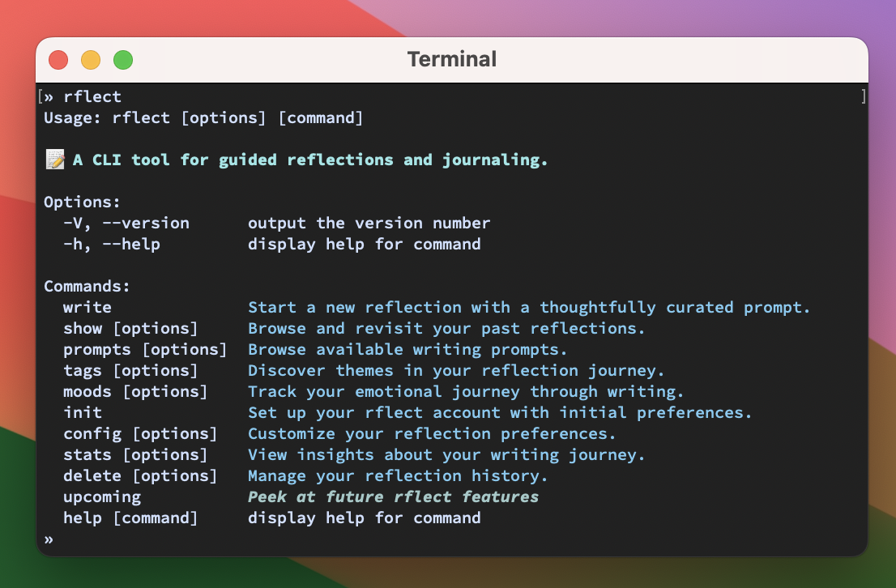

# [rflect](https://rflect.aniqa.dev)

[](https://rflect.aniqa.dev)
[](https://www.npmjs.com/package/rflect)
[](https://github.com/aniqatc/rflect-cli/issues)
[](https://github.com/aniqatc/rflect-cli/blob/main/LICENSE)

📝 A CLI tool for guided reflections and journaling, offering a variety of prompts and tracking features to enhance your writing journey.

<a href="https://rflect.aniqa.dev" target="_blank">

</a>

## ✨ Features

🎯 **Thoughtful Prompts**
- Growth and personal development
- Daily gratitude practice
- Mindfulness exercises
- Thought-provoking questions
- Quote-inspired reflections

📊 **Progress Tracking**
- Writing streaks and milestones
- Word count analytics
- Time spent writing
- Mood patterns
- Entry themes

🔒 **Privacy-First Design**
- Local storage only
- Offline accessibility
- Complete data ownership

## 📦 Installation

```bash
npm install -g rflect
```

## 🚀 Getting Started

During setup, you'll set up a configuration file to store your preferences:

```bash
rflect init
```

## 💾 Privacy & Storage

`rflect` uses local storage:

- Entries are stored in `~/.rflect/entries/`
- Complete offline access
- Private journaling as it saves the entries in the user's file system

## 📝 Commands Overview

**Write a new reflection**

```bash
rflect write
```

**Browse past reflections**

```bash
rflect show [options]
```

- `--all`: Display all entries.
- `--recent`: View the most recent entry.
- `--date`: Find entries from a specific date.
- `--tag`: Find reflections with a specific tag.
- `--category`: Find reflections by prompt type.
- `--mood`: Find reflections by mood.

**Browse the available writing prompts**

```bash
rflect prompts [options]
```

- `--all`: View all prompts.
- `--category <type>`: View prompts by category (mindfulness, gratitude, growth, question, or quote).

**Discover themes throughout your entries**

```bash
rflect tags [options]
```

- `--all`: View all your used tags.
- `--top`: See your 5 most frequent reflection themes.

**Track your emotional journey**

```bash
rflect moods [options]
```

- `--frequency`: See patterns in your recorded moods.
- `--calendar`: View your monthly mood patterns.

**Customize and manage your configuration settings**

```bash
rflect config [options]
```

- `--install`: Reinstall rflect configuration file and directories.
- `--name`: Set your display name.
- `--show`: View current settings.
- `--editor <boolean>`: Toggle system editor usage.
- `--goal`: Configure word count or writing frequency goals.
  - `--type <entries|words>`: Goal type.
  - `--frequency <daily|weekly|monthly>`: Goal frequency.
  - `--value <number>`: Goal value.

**View statistical insights of your writing**

```bash
rflect stats [options]
```

- `--all`: Show comprehensive statistics.
- `--streak`: View streak and progress towards streak goal.
- `--goals`: Show progress on all writing goals.
- `--entries`: Display entry count and word statistics.
- `--time`: Display time-related statistics.

**Manage reflection history**

```bash
rflect delete [options]
```

- `--all`: Remove all entries.
- `--date`: Remove entries from a specific date.

**See a list of upcoming features**: Discover upcoming features like custom themes, cloud backup, search, reminders, encryption, and AI insights.

```bash
rflect upcoming
```

## 🖥️ Tech

- **Core**: `node.js`, `commander`, `inquirer`
- **Date Handling**: `calendar-js`, `date-fns`
- **Styling**: `chalk`
- **Development**: `nodemon`, `eslint`, `prettier`

#### 🔧 Requirements

- **Node.js**: Version 14.0.0 or higher
- **Operating System**: macOS, Linux, or Windows

#### ⌨️ Scripts

```bash
npm run dev     # Run with nodemon for development
npm run lint    # Run ESLint checks
npm run format  # Format code with Prettier
```

#### 🔄 GH Workflow

```bash
npm version [major|minor|patch]     # Bump version and create tag
git push && git push --tags         # Push changes
```

## 🤝 Contributing

Contributions and suggestions are always welcome!

## 📄 License

This project is licensed under the MIT License.
